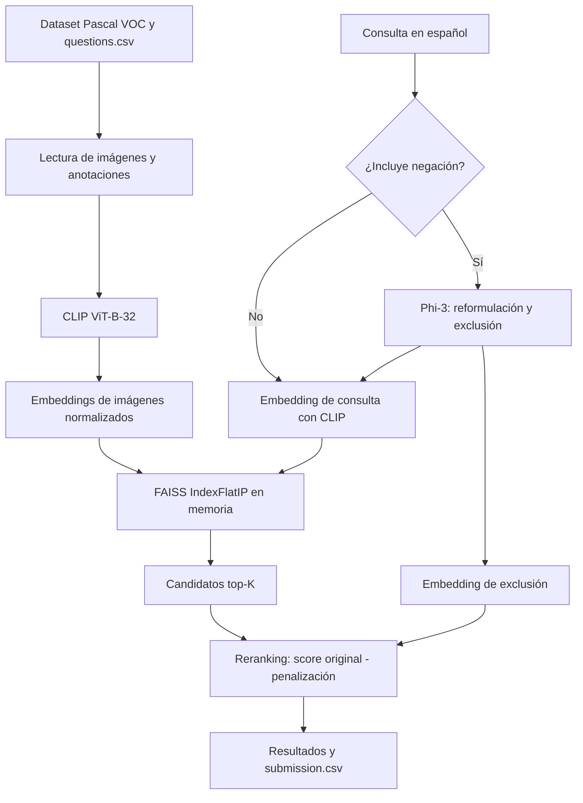

# Sistema de Recuperación Semántica de Imágenes — búsqueda CBIR con consultas negativas

[](https://www.kaggle.com/code/tomasabrate/sistema-recuperacion-semantica-imagenes?scriptVersionId=355616877)

Este repositorio implementa un pipeline de **Content-Based Image Retrieval (CBIR)** para recuperar imágenes de Pascal VOC 2012 a partir de consultas en lenguaje natural. El flujo combina embeddings multimodales de CLIP, búsqueda vectorial en FAISS y un LLM que reformula consultas con negaciones antes de aplicar un reranking penalizado. El resultado operativo es un conjunto ordenado de identificadores de imágenes y un archivo `submission.csv`.

El proyecto se ejecuta como un notebook de análisis y experimentación, no como una aplicación web desplegada. Por lo tanto, no hay una API HTTP, un frontend ni una base de datos persistente en el repositorio.

## Funcionalidades principales

- Carga de imágenes y anotaciones de Pascal VOC 2012 desde Kaggle o rutas locales.
- Generación de embeddings de imágenes y consultas con CLIP `ViT-B-32`.
- Indexación en memoria y recuperación top-K mediante FAISS `IndexFlatIP`.
- Reformulación de consultas en español con `microsoft/Phi-3-mini-4k-instruct`.
- Detección de conceptos excluidos y reranking con una penalización configurable.
- Exploración de embeddings mediante UMAP/t-SNE, K-Means y `silhouette_score`.
- Generación de resultados tabulares y del archivo `submission.csv`.

## Arquitectura y stack

| Componente | Tecnología / implementación |
| :--- | :--- |
| Frontend | No implementado; el notebook es la interfaz de ejecución y visualización |
| Backend | Pipeline Python en `notebooks/Sistema_Recuperacion_Semantica_Imagenes.ipynb` |
| Persistencia | Archivos del dataset, CSV y arrays locales; no hay base de datos |
| ORM / acceso a datos | No aplica; lectura y escritura con `pandas`, `numpy`, PIL y rutas de archivos |
| Comunicación | Llamadas de funciones dentro del notebook; no existe API HTTP |
| Despliegue | Ejecución interactiva en Kaggle o entorno local; no hay Dockerfile |
| Infraestructura | Kaggle Notebook como entorno documentado; no se verificó un proveedor cloud de producción |

Las dependencias principales están declaradas en [`requirements.txt`](requirements.txt). Incluyen PyTorch, `open_clip_torch`, `transformers`, `faiss-cpu`, `bitsandbytes`, `accelerate`, `umap-learn`, `pandas`, OpenCV y scikit-learn.

## Flujo de información

El notebook selecciona el entorno de datos, lee imágenes, anotaciones y consultas, calcula embeddings normalizados y los añade a un índice FAISS en memoria. Para una consulta, CLIP genera el vector positivo; cuando corresponde, Phi-3 produce una reformulación y un vector de exclusión. FAISS devuelve candidatos y el reranking ajusta sus scores antes de construir la salida.



## Persistencia y modelo de datos

No existe un modelo de datos relacional ni un motor SQL. La persistencia observada es orientada a archivos y memoria:

- **Imágenes:** archivos JPEG bajo `dataset/VOC2012_train_val/.../JPEGImages`.
- **Anotaciones:** XML de Pascal VOC bajo `.../Annotations`; se utilizan para obtener clases y metadatos exploratorios.
- **Consultas:** `questions.csv`, con identificadores (`qid`) y consultas en español.
- **Embeddings:** arrays NumPy generados durante el notebook; la ruta `clip_embeddings_full.npy` se utiliza como artefacto de trabajo.
- **Índice vectorial:** `faiss.IndexFlatIP`, construido en memoria a partir de embeddings normalizados. No es una base de datos persistente ni un índice FAISS serializado por el repositorio.
- **Salida:** `submission.csv`, con las columnas `qid` y `preds`.

No hay tablas, claves primarias o foráneas, constraints, índices secundarios, migraciones, historial de estados ni transacciones explícitas. La relación entre una imagen y su resultado se mantiene mediante el orden del embedding y el inventario tabular del notebook, por lo que reconstruir el índice y su contexto es necesario en cada ejecución. Esta elección simplifica la experimentación y es adecuada para un pipeline offline, pero no ofrece durabilidad, concurrencia ni consultas incrementales propias de un servicio de producción.

## Arquitectura backend

El equivalente funcional al backend está organizado como un pipeline de procesamiento, no como una arquitectura web por capas:

- **Carga y configuración:** selecciona rutas de Kaggle o locales y configura dispositivo (`cuda` si está disponible, en otro caso `cpu`).
- **Representación:** `src/utils.py` encapsula la carga de CLIP, el preprocesamiento y el cambio de dispositivo; el notebook calcula los embeddings por lotes.
- **Recuperación:** `search_baseline` codifica una consulta y recupera candidatos desde FAISS.
- **Reformulación y negocio:** `reformulate_for_negation` usa Phi-3 para traducir/enriquecer la consulta y extraer la exclusión; `search_with_reranking` aplica `score_original - penalty_weight * score_exclusion`, con `PENALTY_WEIGHT = 0.5` por defecto.
- **Salida:** funciones del notebook construyen dataframes, visualizan resultados y escriben `submission.csv`.
- **Descarga:** `src/download_data.py` invoca la CLI de Kaggle y extrae el dataset en `data/raw`.

No hay rutas, controladores, servicios independientes, repositorios, middlewares ni serialización HTTP. Tampoco se observan validadores de payloads, códigos HTTP, autenticación, cache o control de concurrencia. El tamaño `k` se utiliza para top-K, pero no hay paginación ni filtros de consulta como contrato de servicio. El coste dominante es la generación de embeddings y la inferencia de Phi-3; `IndexFlatIP` realiza una búsqueda exacta en memoria, cuyo coste crece con el número de vectores.

## Contratos de API

No existen endpoints HTTP implementados, por lo que no hay un contrato REST que documentar. Las interfaces disponibles son funciones internas del notebook:

| Método | Endpoint | Propósito | Entrada | Respuesta |
| :--- | :--- | :--- | :--- | :--- |
| — | — | No aplica: no hay API HTTP | — | — |

Los resultados se exponen como `pandas.DataFrame` y como `submission.csv`, no como respuestas JSON con códigos de estado.

## Integración del frontend

No hay frontend en el repositorio. El notebook actúa como consumidor e integrador del pipeline: recibe consultas desde `questions.csv`, muestra imágenes y resultados mediante `matplotlib`/`pandas` y genera la salida tabular. No utiliza un cliente HTTP ni configura una URL de backend. Una futura interfaz web tendría que encapsular las funciones de búsqueda detrás de una API y resolver el ciclo de vida del modelo y del índice.

## Despliegue y operación

- **Entorno documentado:** Kaggle Notebook, con el dataset disponible bajo `/kaggle/input/tpi-frc-utn-2025-primavera`.
- **Ejecución local:** el notebook contempla rutas relativas bajo `data/raw` y `data/processed`, aunque los datos no están incluidos en Git.
- **Contenedores:** no hay `Dockerfile`, `docker-compose.yml` ni imagen base definida.
- **Puertos y servidor:** no se expone ningún puerto ni se inicia un servidor de aplicaciones.
- **Variables de entorno:** no se observan variables de entorno requeridas por el pipeline. La descarga con Kaggle requiere una instalación/autenticación externa de la CLI y su credencial local; no se documentan valores de credenciales en este README.
- **Cloud, CDN y proxy:** no se verificó infraestructura de producción, CDN, proxy o proveedor frontend.

## Alcance técnico de la participación

El historial Git visible contiene contribuciones de un único autor y muestra una evolución que incluye la estructura inicial del proyecto, ajustes de documentación, optimización del cálculo de `silhouette_score` para Kaggle y estandarización de mensajes de logging. Sobre esa evidencia, la participación técnica se concentró en:

- estructurar el pipeline CBIR y sus utilidades de carga de datos y modelos;
- integrar CLIP, FAISS y el flujo de reformulación/reranking con Phi-3;
- incorporar análisis exploratorio, clustering y evaluación de recuperación;
- adaptar la ejecución a entornos Kaggle y a rutas locales;
- generar el artefacto de salida para las consultas.

No hay evidencia en el repositorio de trabajo colaborativo, pair programming, una API web, una base de datos o un despliegue contenerizado implementados.

## Decisiones técnicas y trade-offs

1. **Embeddings multimodales con CLIP.** Se implementó `ViT-B-32` para representar imágenes y texto en un espacio común. Esto permite consultas semánticas sin entrenar un clasificador específico, a cambio de depender de un modelo preentrenado y de recursos de memoria/GPU.
2. **FAISS `IndexFlatIP` en memoria.** Se eligió producto interno sobre vectores normalizados, equivalente a similitud coseno. Ofrece una integración simple y recuperación exacta rápida para el experimento, pero requiere reconstruir el índice en cada ejecución y no escala como un servicio vectorial distribuido.
3. **LLM cuantizado para negaciones.** Phi-3 se carga con configuración de 4 bits para reformular consultas y separar conceptos excluidos. Reduce el consumo de memoria, pero agrega latencia, dependencia de hardware compatible y variabilidad propia de la generación de texto.
4. **Reranking por penalización.** La exclusión se incorpora restando un score ponderado (`0.5` por defecto) a candidatos similares al concepto negado. Es interpretable y fácil de ajustar, pero el peso es heurístico y no reemplaza una evaluación sistemática de relevancia.
5. **Pipeline reproducible en notebook.** Centralizar el flujo en un notebook facilita inspección, visualización y ejecución en Kaggle. Como coste, no hay separación operativa entre entrenamiento/preprocesamiento y serving, ni pruebas automatizadas o contratos de integración.

## Limitaciones y evolución prevista

Las siguientes capacidades no están implementadas y representan evolución futura justificada por el estado actual del código:

- migraciones y almacenamiento persistente de embeddings e inventarios;
- índices vectoriales serializados o un motor vectorial para evitar reconstrucciones;
- validación con schemas/DTOs y normalización de errores;
- API HTTP, autenticación y autorización si se incorpora un consumidor web;
- paginación, filtros y límites explícitos para consultas de producción;
- transacciones y control de concurrencia para escrituras concurrentes;
- observabilidad de latencia, memoria, fallos de inferencia y calidad de recuperación;
- pruebas automatizadas del pipeline, del reranking y de la descarga de datos;
- sanitización y validación adicional de los artefactos CSV generados;
- configuración externa y versionado de modelos/datasets para reproducibilidad estricta.

## Ejecución local

El repositorio no contiene un servidor ni un script único que ejecute todo el pipeline. El flujo disponible puede iniciarse con:

```bash
pip install -r requirements.txt
```

Después, abrir [`notebooks/Sistema_Recuperacion_Semantica_Imagenes.ipynb`](notebooks/Sistema_Recuperacion_Semantica_Imagenes.ipynb) en Jupyter o Kaggle y ejecutar sus celdas en orden. Para descargar el dataset mediante la utilidad incluida, se requiere instalar y autenticar la CLI de Kaggle por separado:

```bash
pip install kaggle
python src/download_data.py
```

La utilidad usa el identificador `tpi-frc-utn-2025-primavera` y escribe los archivos en `data/raw`; la disponibilidad de ese dataset y de las credenciales de Kaggle no puede verificarse desde este repositorio. El enlace de Kaggle del notebook se conserva como referencia de ejecución, pero su destino depende de la publicación correspondiente en Kaggle.
